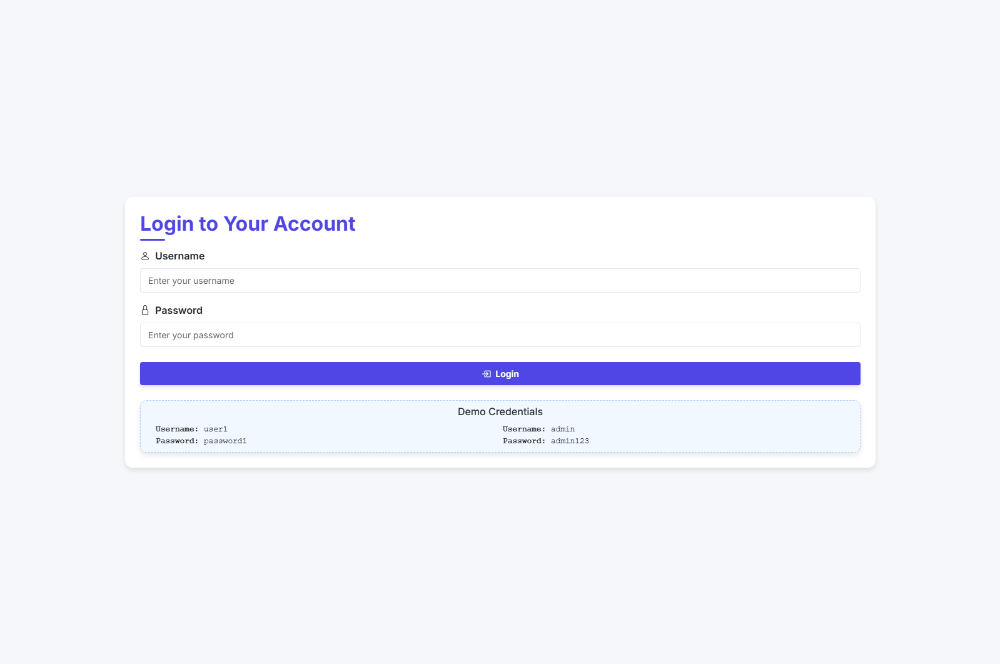
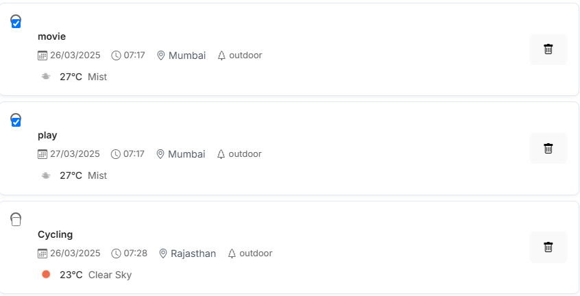

# Weather-Aware Task Manager

A modern, feature-rich task management application built with React that integrates weather data and motivational quotes to enhance productivity.


## 🌟 Features

### Core Functionality
- **Task Management**
  - Create, edit, and delete tasks
  - Mark tasks as complete/incomplete
  - Set task priorities (Low, Medium, High)
  - Categorize tasks (Indoor/Outdoor)
  - Add date, time, and location for tasks

### Weather Integration
- **Real-time Weather Data**
  - Automatic weather updates for outdoor tasks
  - Weather forecasts based on task location and time
  - Visual weather indicators with temperature and conditions

### User Experience
- **Authentication System**
  - Secure user login/logout
  - Protected routes
  - User profile management

### Motivational Features
- **Dynamic Quotes**
  - Motivational messages when adding tasks
  - Inspirational quotes upon task completion
  - Integration with ZenQuotes API

### Task Organization
- **Task Summary**
  - Overview of pending and completed tasks
  - Priority-based task filtering
  - Weather-aware task planning

### UI/UX
- Modern, Todoist-inspired design
- Responsive layout for all devices
- Smooth animations and transitions
- Dark/Light theme support

## 🚀 Getting Started

### Prerequisites
- Node.js (v14.0.0 or higher)
- npm (v6.0.0 or higher)
- OpenWeatherMap API key
- Modern web browser

### Installation

1. Clone the repository
```bash
git clone https://github.com/vrushab123/Task-Manager
cd task-manager
```

2. Install dependencies
```bash
npm install
```

3. Create environment variables
Create a `.env` file in the root directory:
```env
VITE_WEATHER_API_KEY=your_openweathermap_api_key
VITE_API_URL=your_backend_api_url
```

4. Start the development server
```bash
npm run dev
```

The application will be available at `http://localhost:5173`

## 🛠️ Built With

- **Frontend Framework**: React 18
- **State Management**: Redux Toolkit
- **Routing**: React Router v6
- **Styling**: CSS Modules
- **Build Tool**: Vite
- **APIs Integration**:
  - OpenWeatherMap API
  - ZenQuotes API

## 📱 Screenshots

### Dashboard

The main dashboard showing task list and weather information.

### Login Page

Adding a new task with weather awareness.

### Weather Integration

Weather information displayed for outdoor tasks.

## 🔑 Key Features Explained

### Weather Integration
```javascript
// Example of weather data integration
const WeatherDisplay = ({ location }) => {
  const weatherData = useWeatherData(location);
  return (
    <div className="weather-display">
      <Temperature value={weatherData.temp} />
      <WeatherIcon condition={weatherData.condition} />
    </div>
  );
};
```

### Motivational Quotes
```javascript
// Example of quote integration
const QuoteDisplay = ({ show, quote }) => {
  return (
    <div className={`quote-container ${show ? 'show' : ''}`}>
      <p className="quote-text">{quote}</p>
    </div>
  );
};
```

## 🤝 Contributing

1. Fork the repository
2. Create your feature branch (`git checkout -b feature/AmazingFeature`)
3. Commit your changes (`git commit -m 'Add some AmazingFeature'`)
4. Push to the branch (`git push origin feature/AmazingFeature`)
5. Open a Pull Request

## 📝 License

This project is licensed under the MIT License - see the [LICENSE.md](LICENSE.md) file for details.

## 🙏 Acknowledgments

- OpenWeatherMap API for weather data
- ZenQuotes API for motivational quotes
- Todoist for design inspiration
- React community for amazing tools and libraries

